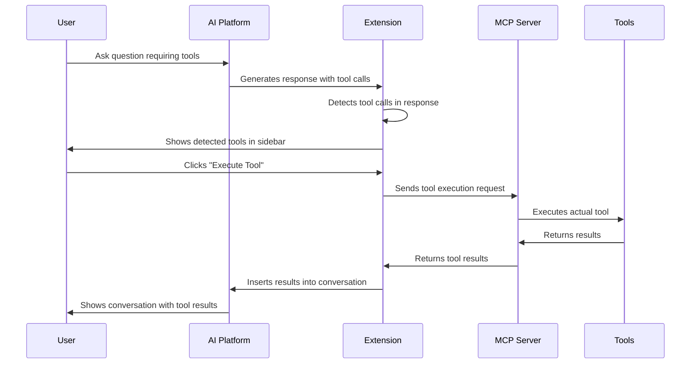

# 🚀 MCP SuperAssistant v0.2.0

**Chrome extension that brings MCP (Model Context Protocol) to AI platforms including Scira.AI, ChatGPT, Perplexity, Gemini, and more!**

[](https://github.com/emperorjke/MCP-SuperAssistant/releases)
[](LICENSE)
[](https://chrome.google.com/webstore)

## ✨ NEW: Scira.AI Support!

This version adds comprehensive support for **Scira.AI** - a minimalistic AI-powered search engine. Experience seamless MCP tool integration with Scira's clean interface and powerful search capabilities.

## 🎯 Features

### 🌟 **Platform Support**
- **✅ Scira.AI** (NEW!) - Minimalistic AI search engine
- **✅ ChatGPT** - OpenAI's conversational AI
- **✅ Perplexity** - AI-powered search and answers
- **✅ Google Gemini** - Google's advanced AI model
- **✅ Grok** - xAI's conversational AI
- **✅ Google AI Studio** - Google's AI development platform
- **✅ OpenRouter** - Access to multiple AI models
- **✅ DeepSeek** - Advanced reasoning AI
- **✅ Kagi** - Privacy-focused search with AI
- **✅ T3 Chat** - Text-based AI interactions

### 🔧 **Core Features**
- **Smart Tool Detection** - Automatically detects MCP tool calls in AI responses
- **One-Click Execution** - Execute tools with a single click from the sidebar
- **Result Integration** - Seamlessly insert tool results back into conversations
- **Multiple Formats** - Support for JSON, XML, function calls, and markdown
- **Auto-Execute Mode** - Automatically execute detected tools
- **Auto-Submit Mode** - Automatically submit results after insertion
- **Theme Adaptation** - Automatically adapts to platform themes (light/dark)
- **Sidebar UI** - Clean, resizable sidebar that doesn't interfere with platform UIs

### 🎨 **Scira.AI Specific Features**
- **Next.js Compatibility** - Seamless integration with Scira's Next.js architecture
- **Search Context Awareness** - Optimized for search query contexts
- **Minimalist Design** - UI matches Scira's clean aesthetic
- **React Component Integration** - Full compatibility with React-based inputs
- **Navigation Handling** - Robust support for SPA navigation

## 🚀 Quick Start

### 1. Installation

#### Option A: Chrome Web Store (Recommended)
*Coming soon - extension is under review*

#### Option B: Developer Mode
1. Download the latest release from [Releases](https://github.com/emperorjke/MCP-SuperAssistant/releases)
2. Unzip the downloaded file
3. Open `chrome://extensions/` in Chrome
4. Enable "Developer mode" (top right)
5. Click "Load unpacked" and select the unzipped directory

### 2. Setup MCP Server

```bash
# Install and start the MCP proxy server
npx @srbhptl39/mcp-superassistant-proxy@latest --config ./mcpconfig.json
```

Example `mcpconfig.json`:
```json
{
  "mcpServers": {
    "desktop-commander": {
      "command": "npx",
      "args": ["-y", "@wonderwhy-er/desktop-commander"]
    },
    "filesystem": {
      "command": "npx",
      "args": ["-y", "@modelcontextprotocol/server-filesystem", "/path/to/allowed/files"]
    }
  }
}
```

### 3. Connect Extension

1. Open any supported AI platform (e.g., https://scira.ai)
2. The MCP SuperAssistant sidebar will appear on the right
3. Click the connection status indicator
4. Enter your MCP server URL (default: `http://localhost:3006/sse`)
5. Click "Connect"

### 4. Start Using Tools!

1. Ask the AI to use a tool: *"Can you search for information about climate change?"*
2. The AI will respond with a tool call
3. Click "Execute" in the sidebar when the tool is detected
4. Results will be automatically inserted back into the conversation

## 🛠️ Development

### Prerequisites
- Node.js 16+
- pnpm (recommended) or npm

### Setup
```bash
# Clone the repository
git clone https://github.com/emperorjke/MCP-SuperAssistant.git
cd MCP-SuperAssistant

# Install dependencies
pnpm install

# Start development server
pnpm dev

# Build for production
pnpm -r run ready
pnpm --filter chrome-extension build
pnpm --filter @extension/content-script build

# Create distribution package
pnpm zip
```

### Project Structure
```
src/
├── platforms/
│   ├── SciraPlatform.ts      # Scira.AI integration
│   ├── BasePlatform.ts       # Base platform class
│   └── ...                   # Other platform implementations
├── components/
│   ├── SidebarManager.tsx    # React sidebar UI
│   └── ToolResult.tsx        # Tool result display
├── utils/
│   └── ToolCallParser.ts     # Enhanced tool call detection
├── client/
│   └── MCPClient.ts          # MCP server communication
├── managers/
│   └── PlatformManager.ts    # Platform detection and management
├── background.ts             # Chrome extension background script
├── content-script-init.ts    # Content script initialization
└── popup/                    # Extension popup UI
```

### Testing
```bash
# Run all tests
pnpm test

# Run tests with coverage
pnpm test:coverage

# Run tests in watch mode
pnpm test:watch
```

## 🎯 How It Works



## 🔧 Configuration

### Sidebar Settings
- **Auto Execute** - Automatically execute detected tools
- **Auto Submit** - Automatically submit results after insertion
- **Show Preview** - Show preview dialog before inserting results

### Advanced Settings
Access advanced settings through the extension popup:
- **MCP Server URL** - Configure your MCP server endpoint
- **Sidebar Position** - Left or right sidebar placement
- **Theme** - Auto-detect or manual theme selection

## 🧪 Testing on Scira.AI

1. Visit https://scira.ai
2. Ask a question that would benefit from tools:
   - *"Search for the latest news about AI developments"*
   - *"Find information about renewable energy statistics"*
   - *"Get weather data for New York"*
3. Look for tool calls in the AI response
4. Use the sidebar to execute tools and insert results

### Example Tool Formats Supported

**JSON Format:**
```json
{"tool": {"name": "search_web", "arguments": {"query": "AI news", "limit": 5}}}
```

**XML Format:**
```xml
<mcp:search_web query="AI news" limit="5" />
```

**Function Call Format:**
```javascript
search_web(query="AI news", limit=5)
```

## 🐛 Troubleshooting

### Common Issues

**Sidebar not appearing:**
- Ensure the extension is enabled in Chrome
- Refresh the page
- Check that you're on a supported platform

**Tool calls not detected:**
- Verify the AI is generating properly formatted tool calls
- Check the browser console for detection logs
- Try different tool call formats (JSON, XML, function)

**MCP server connection failed:**
- Ensure the proxy server is running: `npx @srbhptl39/mcp-superassistant-proxy@latest`
- Check the server URL in extension settings
- Verify no firewall is blocking localhost connections

**Tools not executing:**
- Check MCP server logs for errors
- Verify your `mcpconfig.json` is valid
- Ensure required MCP servers are installed and configured

### Getting Help

1. Check the [GitHub Issues](https://github.com/emperorjke/MCP-SuperAssistant/issues)
2. Review the [MCP Documentation](https://modelcontextprotocol.io/)
3. Join our community discussions

## 🤝 Contributing

We welcome contributions! Please see our [Contributing Guide](CONTRIBUTING.md) for details.

### Development Workflow
1. Fork the repository
2. Create a feature branch: `git checkout -b feature/amazing-feature`
3. Make your changes and add tests
4. Ensure all tests pass: `pnpm test`
5. Commit your changes: `git commit -m 'Add amazing feature'`
6. Push to the branch: `git push origin feature/amazing-feature`
7. Open a Pull Request

## 📝 Changelog

### v0.2.0 - Scira.AI Support
- ✅ **NEW**: Complete Scira.AI platform integration
- ✅ **Enhanced**: Multi-format tool call detection (JSON, XML, functions, markdown)
- ✅ **Improved**: React-based sidebar UI with theme adaptation
- ✅ **Added**: Multiple result insertion modes (append, replace, new message)
- ✅ **Enhanced**: Next.js SPA navigation support
- ✅ **Improved**: Comprehensive error handling and user experience
- ✅ **Added**: Extensive test coverage for new features

### v0.1.x - Previous Versions
- Platform support for ChatGPT, Perplexity, Gemini, etc.
- Basic tool detection and execution
- Sidebar UI implementation

## 📄 License

This project is licensed under the MIT License - see the [LICENSE](LICENSE) file for details.

## 🙏 Acknowledgments

- Inspired by the [Model Context Protocol (MCP)](https://modelcontextprotocol.io/) by Anthropic
- Thanks to [Cline](https://github.com/cline/cline) for idea inspiration
- Built with [Chrome Extension Boilerplate with React + Vite](https://github.com/Jonghakseo/chrome-extension-boilerplate-react-vite)
- Special thanks to the Scira.AI team for creating an excellent minimalist search platform

## 🔗 Links

- **GitHub Repository**: https://github.com/emperorjke/MCP-SuperAssistant
- **Chrome Web Store**: *Coming soon*
- **MCP Documentation**: https://modelcontextprotocol.io/
- **Scira.AI**: https://scira.ai

---

**⭐ If you find this extension helpful, please give it a star on GitHub!**